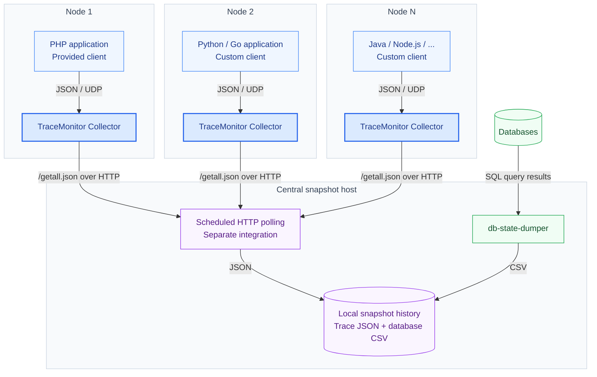

# TraceMonitor Collector

**See what your applications are doing right now.**

[](go.mod)
[](LICENSE)

A lightweight Go service that receives trace updates over UDP and keeps the latest trace and current span for each process in memory. The protocol works with **any programming language**; [PHP](https://github.com/belka-tech/trace-monitor-php-client) is currently the only provided client. Other languages can implement the same [JSON/UDP protocol](#udp-protocol).

[Architecture](#architecture) · [Quick start](#quick-start) · [Configuration](#configuration) · [PHP example](#php-example) · [UDP protocol](#udp-protocol)

## Architecture

Run a **Collector on every application node**. Applications send events to their local Collector over UDP. For centralized history, a separate snapshot host can poll all Collectors over HTTP and save their state to its own disk alongside database snapshots.



- **Local state:** each Collector holds one current trace per PID and exposes it for live inspection, HTTP snapshots and Prometheus scraping. Keep nodes and container PID namespaces isolated so identical PIDs cannot overwrite each other.
- **Central history:** the snapshot host fetches `/getall.json` from every node and stores the responses by node and time. Scheduled [DB State Dumper](https://github.com/belka-tech/db-state-dumper) runs on the same host can save database activity and lock snapshots beside them, with a configuration and output directory per database.

The diagram shows a deployment pattern: the published [db-state-dumper command](https://github.com/belka-tech/db-state-dumper/blob/master/src/Command/DbStateDumperCommand.php) currently collects **SQL results only**. HTTP polling of Collectors requires a separate scheduled job.

For a request stuck on `db.query`, compare its span, SQL and timestamp with the database snapshots from that period. Correlation is manual; a database connection ID captured in span context can help identify the exact session.

## Quick start

Requires **Go 1.20+**. From the repository directory:

```sh
go build -o build/trace-monitor-collector .
./build/trace-monitor-collector -config ./config.yaml
```

The supplied [config.yaml](config.yaml) listens on **UDP 20001** and **HTTP 20000**. Point your application's client at its local Collector, for example `127.0.0.1:20001` on the same host. The example configuration includes PHP-FPM cleanup settings; see [Configuration](#configuration) for other runtimes.

Open **[localhost:20000/getall](http://localhost:20000/getall)** to inspect active traces. The view is empty until the client sends events.

<details>
<summary>Build for Linux (amd64)</summary>

```sh
CGO_ENABLED=0 GOOS=linux GOARCH=amd64 go build -o build/trace-monitor-collector .
```

Run the resulting binary on the target Linux host with your configuration file.

</details>

## Configuration

Pass `-config <path>` to select a YAML file; otherwise the collector reads `config.yaml` from the current directory. Values below come from the [example configuration](config.yaml).

| Setting | Example | Purpose |
| --- | --- | --- |
| `udp_port_range` | `"20001-20001"` | Inclusive UDP port range; use `start-end` even for one port. |
| `http_addr` | `":20000"` | HTTP listen address. |
| `fpm_status_url` | `"http://127.0.0.1:80/fpm-status?json&full"` | Full JSON status for the PHP-FPM workers being monitored. |
| `http_client_timeout` | `3` | Timeout for PHP-FPM status requests, in seconds. |
| `load_fpm_status_timeout` | `10` | PHP-FPM polling interval, in seconds. |
| `stuck_process_duration` | `10` | Seconds since the last update before checking a PID against PHP-FPM. |
| `buffer` | `1048576` | UDP read buffer size, in bytes. |
| `packets_size` | `100` | Queue capacity per UDP port, in packets. |
| `app_name` | `"app-name"` | Prometheus `app` label. |
| `env` | `"testing"` | Prometheus `env` label. |

For non-PHP runtimes, set `fpm_status_url: ""` and send `free-pid` when a trace ends. Automatic stale-process cleanup currently supports PHP-FPM only. The poller has no disable flag: with an empty URL, status requests fail and cleanup is skipped; collection continues, and these errors are logged with `-v`. Keep the polling interval positive.

Use a PHP-FPM status endpoint only for its own workers: cleanup removes old entries whose PIDs are missing from that pool. See the [PHP example](#php-example).

## HTTP & metrics

| Endpoint | What you get |
| --- | --- |
| `/getall` | Browser view of the current state. |
| `/getall.json` | Current traces, spans, context, tags and collector statistics as JSON. |
| `/console/metrics` | Prometheus metrics for active PIDs, trace/span events and UDP processing. |

In the trace output, `elapsedTime` measures time since the last recorded update.

Add the collector to your Prometheus configuration:

```yaml
scrape_configs:
  - job_name: trace-monitor
    metrics_path: /console/metrics
    static_configs:
      - targets: ["127.0.0.1:20000"]
```

Use the collector's reachable address when Prometheus runs elsewhere. Collector metrics carry `node`, `app` and `env` labels. Useful starting points are `trace_monitor_count_active_pid` and `trace_monitor_total_channel_reset`, which counts queue overflows that discard pending packets.

The collector keeps live state in memory; completed traces are removed and restarts clear the state. UDP delivery is best effort. Keep the HTTP and UDP listeners on a trusted network: trace data can contain SQL, application context and backtraces, and the collector has no built-in authentication.

## PHP example

The [PHP client](https://github.com/belka-tech/trace-monitor-php-client) is one implementation of the shared protocol. Configure its `TraceMonitorCollectorClient` with the local Collector's IP and UDP port. In your application, call `openTrace()` / `closeTrace()` on `TraceMonitorService` around each request, and `openSpan()` / `closeSpan()` around operations such as SQL queries or HTTP calls. The client sends span context, tags, backtraces and the parent chain; see its [service API](https://github.com/belka-tech/trace-monitor-php-client/blob/master/src/Service/TraceMonitorService.php).

For PHP-FPM, set `fpm_status_url` to the **full JSON status endpoint** of the monitored workers. Once a PID has had no updates for `stuck_process_duration`, the Collector checks it against PHP-FPM and removes it if it is idle or missing. Busy workers remain visible, so you can inspect their current spans while a request is stuck.

## UDP protocol

Each datagram contains one JSON object with `method`, `sentAt`, `pid` (a string), `traceId` and `data`. Use RFC 3339 timestamps with a timezone and enough precision to order events.

| Method | Effect | `data` |
| --- | --- | --- |
| `init-trace` | Opens a trace for a PID. | Trace context, tags and `openedAt`. |
| `set-trace-current-span` | Updates the current span and its parent chain. | `span` and `parentSpans`; `null` clears the current span. |
| `free-pid` | Removes the PID's trace state. | `null`. |

<details>
<summary>JSON examples</summary>

### Open a trace

```json
{
  "method": "init-trace",
  "sentAt": "2025-08-28T16:34:12.123456+03:00",
  "pid": "12345",
  "traceId": "abc123",
  "data": {
    "context": { "userId": "42" },
    "tags": { "service": "api" },
    "openedAt": "2025-08-28T16:34:12.123456+03:00"
  }
}
```

### Set the current span

```json
{
  "method": "set-trace-current-span",
  "sentAt": "2025-08-28T16:34:15.000000+03:00",
  "pid": "12345",
  "traceId": "abc123",
  "data": {
    "span": {
      "id": "span-1",
      "parent": "span-0",
      "openedAt": "2025-08-28T16:34:15.000000+03:00",
      "name": "db.query",
      "context": { "sql": "SELECT id FROM users WHERE id = 42" },
      "tags": { "database": "primary" },
      "debugBacktrace": [
        { "file": "/app/src/UserRepository.php", "line": 42, "function": "find" }
      ]
    },
    "parentSpans": [
      {
        "id": "span-0",
        "parent": null,
        "openedAt": "2025-08-28T16:34:13.000000+03:00",
        "name": "http.request",
        "context": { "path": "/users/42" },
        "tags": { "method": "GET" },
        "debugBacktrace": []
      }
    ]
  }
}
```

`parent` is a span ID or `null`. Entries in `parentSpans` use the same shape as `span`; their count is limited by the PHP client's `countParentForDataPackage` setting.

### Release the PID

```json
{
  "method": "free-pid",
  "sentAt": "2025-08-28T16:34:30.000000+03:00",
  "pid": "12345",
  "traceId": "abc123",
  "data": null
}
```

</details>

## License

[MIT](LICENSE) · BelkaCar
